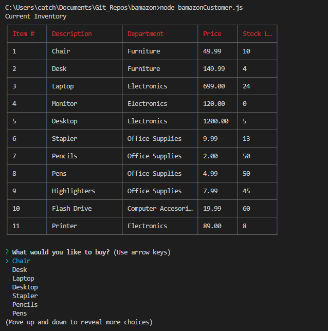
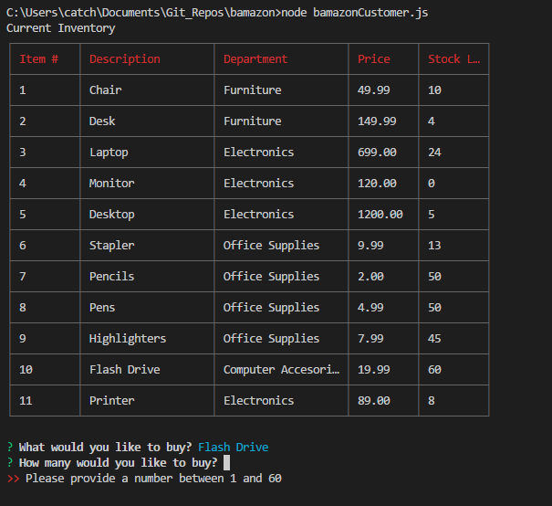
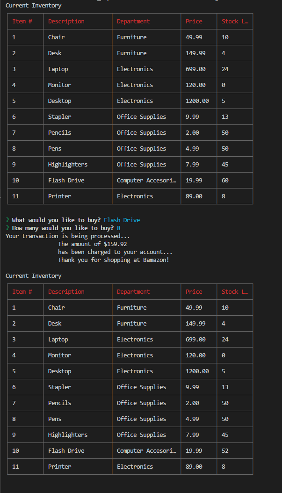

# bamazon

## What is Bamazon?

Bamazon is a CLI application that does the following:
    * Displays a table containing the items currently in the MySQL database.
    * Prompts the user for which item and the quantity of the selected item he/she would like to buy.
    * Displays the price of the transaction.
    * Updates the quantities within the database and displays the database containing the updated data.

## Why Bamazon?

Bamazon serves to accomplish the following:
    * Items are displayed in an easy-to-read table fashion
    * Only items that are in-stock are displayed in the menu
    * Once an item is selected, the stock quantity is retrieved and used in validation; therefore, the buyer
        cannot buy more than what is available.

## How do I use bamazon?

#### Step 1: Install dependencies and run node bamazonCustomer.js

 

#### Step 2: Choose an item from the provided list and enter a quantity:

If the inputed value is not a number, less than 1 or more than the stock quantity, the user is prompted to enter
a number within the valid range.

If the value is correct, the total for the transaction is displayed, as well as the updated inventory.
